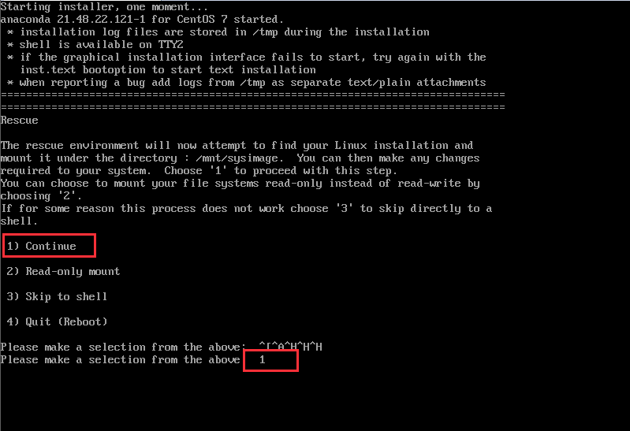
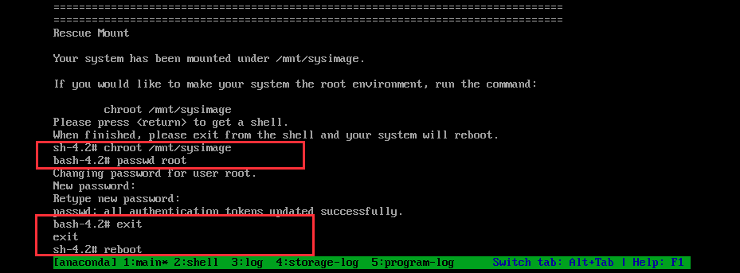
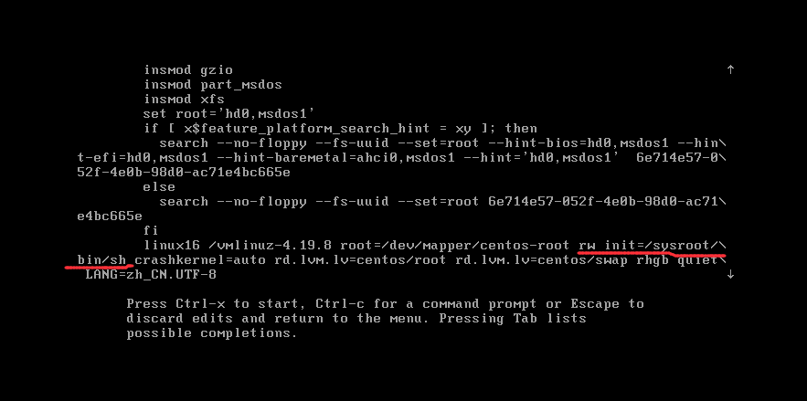

# CentOS 7 root密码忘记

[centos7不同版本下载](https://man.linuxde.net/download/CentOS/)

   注：所有环境均在vmware虚拟机上实现

## 一.通过光盘镜像进入救援模式修改root密码

这种方法要确保挂载的光盘镜像和运行的虚拟机是同样的操作系统版本，这样在挂载完成修改密码之后，下载启动的时候，不会出现问题。这种找回密码的思路是：将要挂载的光盘镜像中的sysimage中的启动操作系统的镜像，挂载到正在运行的虚拟机操作系统中，修改完密码之后，用修改完密码的镜像去替换之前的镜像，下次启动的时候，直接加载修改完密码的镜像，即可完成登录操作。

  1）在虚拟机关闭状态下，选择“打开电源时进入固件”或者在虚拟机启动时，按F2进入BIOS；然后通过键盘“左”、“右”键选择到“BOOT”， 使用方向键“上”、“下”和“+”“-”号将CD-ROM Drive调为第一启动方式，F10保存退出。


  2）系统重启后进入centos系统安装的界面，选择“Troubleshooting”，接着选择“Rescure a CentOS system”,进入系统救援模式；


 


  3）接着在光标后输入“1”，选择“continue”选项；



待系统刷新后，在系统环境输入以下命令, 并键入新的root用户的密码;

```shell
# chroot /mnt/sysimage
# passwd root
# exit
# reboot
```




接着重启系统，并将第一启动项修还原为“+Hard Drive”模式。


  4）至此通过光盘启动救援模式修改root密码就完成了，系统重启后，输入设置的root密码即可。


## 二.通过进入grub进行修改root密码


  1）开机时随便按下键盘，进入系统选择菜单，选择第一项，按e键进行修改；


  2）定位到 ro （ro=readonly 只读），把ro改成 “rw init=/sysroot/bin/sh”. 完成之后按Ctrl+x键，进入救援模式；



  3）进入单用户模式，依次输入以下命令进行root密码修改，完成之后强制重启即可

```shell
# chroot /sysroot/ （改变根）
# passwd root
# touch /.autorelabel （为了使selinux生效）
# exit
# reboot
```


